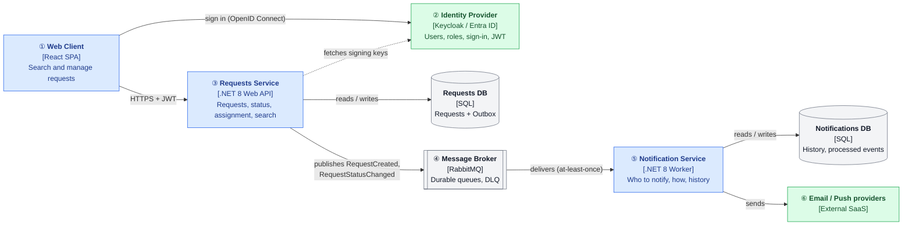
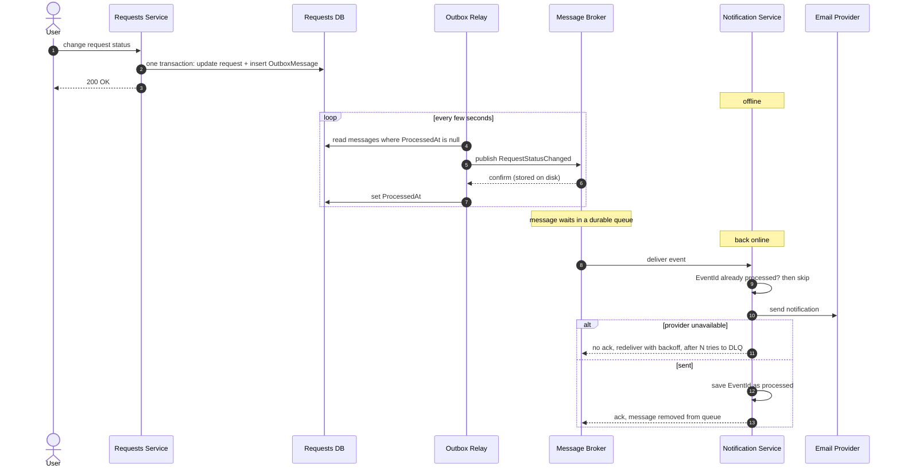

# ארכיטקטורת Microservices – מערכת ניהול בקשות

המסמך מציג חלוקה אפשרית של המערכת ל-Microservices, את התועלות והמחיר של החלוקה,
ואת התכנון לתקשורת אמינה בין השירותים כאשר מערכת ההתראות אינה זמינה.

## 1. מבט על

**מקרא:** כחול – קוד שאנחנו כותבים · ירוק – מוצר מוכן · אפור – תשתית

| # | רכיב | תפקיד |
|---|---|---|
| ① | **Web Client** | ממשק ה-React הקיים. מתחבר דרך ה-IdP ושולח את הטוקן בכל קריאה. |
| ② | **Identity Provider** | מוצר מוכן לניהול משתמשים, תפקידים והתחברות. מנפיק JWT לפי OpenID Connect. מחליף את ה-headers שמדמים היום את המשתמש. |
| ③ | **Requests Service** | ליבת המערכת: יצירה ועדכון של בקשות, סטטוסים, שיוך, כללי הרשאה וחיפוש. הבעלים היחיד של נתוני הבקשות. מפרסם אירוע על כל יצירה ושינוי סטטוס. |
| ④ | **Message Broker** | מעביר אירועים בין השירותים ושומר אותם בתור עמיד עד שהצרכן מסיים לטפל בהם. |
| ⑤ | **Notification Service** | מאזין לאירועים, מחליט למי ובאיזה ערוץ להודיע, ושולח. הבעלים של היסטוריית ההתראות. |
| ⑥ | **Email / Push providers** | ספקים חיצוניים שמבצעים את השליחה בפועל. |

**עקרונות:**
- לכל שירות DB משלו. אף שירות לא ניגש ל-DB של שירות אחר.
- Requests ו-Notification לא מכירים זה את זה ולא מדברים ישירות – רק דרך אירועים ב-Broker.
- את ה-IdP וה-Broker לא כותבים – בוחרים מוצר קיים ומגדירים אותו.

**API Gateway:** לא נכלל, כי יש שירות ציבורי אחד בלבד (Requests). Notification לא חושף API,
וההתחברות נעשית ישירות מול ה-IdP. כשיתווספו שירותים נוספים עם API ציבורי, Gateway ייתן ללקוח
כתובת אחת, ויטפל במקום אחד ב-TLS, CORS ו-rate limiting.

## 2. תועלות ומחיר

### תועלות

| תועלת | מה זה נותן כאן |
|---|---|
| **בידוד תקלות** | כש-Notification או ספק המייל נופלים, יצירה ועדכון של בקשות ממשיכים לעבוד. |
| **סקייל עצמאי** | Requests (בעיקר החיפוש) מקבל הרבה יותר תעבורה, ואפשר להגדיל רק אותו. עומס של התראות נספג בתור ולא מאט את Requests. |
| **פריסה עצמאית** | ערוץ התראה חדש או שינוי תבנית מייל נפרסים בלי לגעת בליבה. |
| **צימוד נמוך** | Requests רק מפרסם אירועים. צרכן חדש (דוחות, אינטגרציה חיצונית) מתחבר לתור בלי שינוי ב-Requests. |
| **אבטחה במקום אחד** | התחברות, MFA וניהול משתמשים לא נכתבים מחדש בכל שירות. |
| **בעלות צוותית** | לכל צוות שירות, DB וקצב שחרורים משלו. |

### מחיר

| מחיר | משמעות |
|---|---|
| **Eventual consistency** | ההתראה מגיעה באיחור של שניות, ואם Notification לא זמין – גם שעות. מקובל עבור התראות. |
| **מורכבות תפעולית** | Broker שצריך להריץ ולנטר, וכמה שירותים ו-DBs לפרוס ולגבות במקום אחד. |
| **Debugging מבוזר** | פעולה אחת עוברת בין כמה שירותים. נדרשים Correlation ID ולוגים מרכזיים. |
| **הודעות כפולות** | Broker מוסר הודעה לפחות פעם אחת, ולכן כל צרכן חייב לזהות ולדלג על הודעה שכבר טיפל בה. הפתרון מפורט בסעיף 3 (Idempotent Consumer). |

**לסיכום:** הפיצול מוצדק כשהמערכת גדלה. בשלב ביניים, Modular Monolith עם אותם גבולות
(מודול בקשות, מודול התראות, אירועים פנימיים) נותן את רוב היתרונות בלי המחיר, ומאפשר לפצל בהמשך.

## 3. תקשורת אמינה – בקשה נוצרה או שינתה סטטוס

**הדרישה:** כל יצירה ושינוי סטטוס של בקשה מסתיימים בהתראה למשתמש הרלוונטי,
גם אם Notification אינו זמין באותו רגע. ההתראה יכולה להגיע באיחור, אבל אסור שתאבד,
ואסור שהתקלה תפיל את הפעולה של המשתמש.

### הבעיה

- **קריאה ישירה (HTTP) מ-Requests ל-Notification** יוצרת צימוד בזמן: שני השירותים חייבים להיות זמינים באותו רגע.
  אם Notification לא זמין, או שהפעולה של המשתמש נכשלת, או שההתראה אובדת.
- **גם עם Broker נשארת בעיית ה-Dual Write:** שמירה ב-DB ופרסום ל-Broker הן כתיבה לשתי מערכות, בלי טרנזקציה משותפת.
  נפילה בין שתי הפעולות משאירה בקשה שנשמרה בלי אירוע – ההתראה אבדה בשקט.
  הפיכת הסדר לא עוזרת: אז יכולה להישלח התראה על שינוי שלא נשמר.

### הפתרון

| שכבה | פותרת | איך |
|---|---|---|
| **Transactional Outbox** | Dual Write | האירוע נשמר בטבלת `OutboxMessages` **באותה טרנזקציה** של הבקשה. תהליך רקע (Relay) מפרסם אותו ל-Broker, ומסמן `ProcessedAt` רק אחרי שה-Broker אישר קבלה. |
| **Durable Queue** | Notification לא זמין | ההודעה נשמרת בתור עד ש-Notification מטפל בה ושולח ack. |
| **Idempotent Consumer** | הודעות כפולות | לכל אירוע יש `EventId`. Notification שומר אילו אירועים כבר טופלו ומדלג על כפילויות. |
| **Retry + Dead Letter Queue** | כשל זמני או קבוע | ניסיון חוזר עם השהיה הולכת וגדלה (exponential backoff). אחרי N כשלונות ההודעה עוברת ל-DLQ לבדיקה ידנית, בלי לחסום את התור. |

### הזרימה

| שלבים | מה קורה |
|---|---|
| 1–3 | הבקשה והאירוע נשמרים בטרנזקציה אחת – יחד או לא בכלל. המשתמש מקבל תשובה מיד ולא מחכה ל-Broker או ל-Notification. |
| 4–7 | ה-Relay (תהליך רקע בתוך Requests) שולח ל-Broker אירועים שעוד לא נשלחו. אם ה-Broker לא זמין, השורה נשארת ב-Outbox ותישלח בסבב הבא. |
| 8 | Notification לא היה זמין – ההודעה חיכתה בתור, ונמסרת כשהוא חוזר. |
| 9 | בדיקת כפילות לפי `EventId` ב-DB של Notification. |
| 10–11 | ספק השליחה לא זמין: אין ack, וה-Broker מחזיר את ההודעה לתור לניסיון נוסף. כשל קבוע מסתיים ב-DLQ. |
| 12–13 | ההתראה נשלחה: `EventId` נשמר כמטופל, ורק אז נשלח ack וההודעה נמחקת מהתור. |

### הבטחת מסירה

- **At-least-once:** ההודעה תגיע לפחות פעם אחת. כפילות יכולה לקרות, למשל אם ה-Relay נפל אחרי הפרסום ולפני הסימון,
  או אם Notification נפל אחרי השליחה ולפני ה-ack. בדיקת ה-`EventId` בצד הצרכן הופכת את התוצאה ל"פעם אחת בפועל".
- **סדר:** בגלל ניסיונות חוזרים, אירועים של אותה בקשה יכולים להגיע שלא לפי הסדר.
  כל אירוע נושא `OccurredAt`, כך שהצרכן יכול לזהות אירוע ישן ולהתעלם ממנו.
- **תוכן האירוע:** האירוע מתאר עובדה (למשל: הבקשה עברה מסטטוס "חדשה" לסטטוס "בטיפול") ונושא את המידע הדרוש לצרכן –
  מזהה הבקשה, הבעלים, המטופל ומי ביצע את השינוי. Requests לא יודע שקיימות התראות;
  ההחלטה למי ואיך להודיע שייכת ל-Notification.

## 4. נושאים רוחביים

- **לוגים ו-Tracing:** כל שירות כותב לוגים מובנים (OpenTelemetry) למערכת מרכזית (Seq / ELK).
  Correlation ID עובר בכל קריאת HTTP ובכל הודעה ב-Broker, כך שאפשר לעקוב אחרי פעולה אחת מקצה לקצה.
- **אימות:** כל שירות שמקבל קריאות מאמת את ה-JWT בעצמו.
- **ניטור:** התראות לצוות על הצטברות ב-Outbox, על תור שמתארך ועל כל הודעה שמגיעה ל-DLQ.

